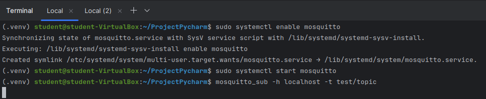
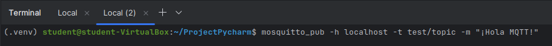
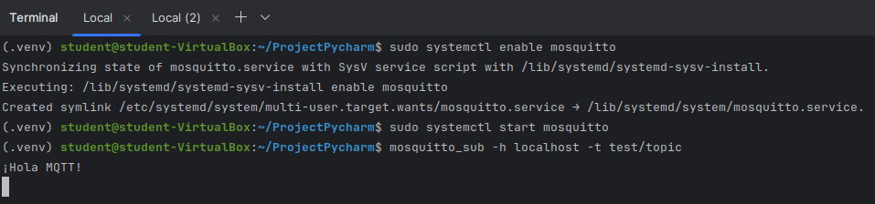

# Constrained Device Application (Connected Devices)

## Lab Module 06

Be sure to implement all the PIOT-CDA-* issues (requirements) listed.

### Description

NOTE: Include two full paragraphs describing your implementation approach by answering the questions listed below.

What does your implementation do? 

Se ha desarrollado e integrado un módulo de comunicación MQTT para un dispositivo con recursos limitados. 
Comienza configurando el MqttClientConnector con los ajustes básicos del cliente y la lógica de conexión, incluyendo 
callbacks para manejar la conexión, desconexión y recepción de mensajes. Se implementan las funciones clave de 
publicación y suscripción con validación y registros informativos. Por último, el módulo se integra en el 
DeviceDataManager, permitiendo la gestión completa del ciclo de vida del cliente MQTT, verificada mediante pruebas de 
integración.

How does your implementation work?

A continuación, se detalla el procedimiento seguido para implementar los requisitos establecidos en el Lab Module 06:

PIOT-CFG-06-001 -> Se ha procedido a instalar el broker Mosquitto MQTT y las herramientas de cliente pertinentes 
(mosquitto_pub y mosquitto_sub). Se procede a dejar algunas capturas de pantalla para confirmar la correcta instalación:

PIOT-CDA-06-000 -> Se ha procedido a crear una nueva rama labmodule06 para empezar la elaboración de la práctica 06.

PIOT-CDA-06-001 -> Se ha procedido a modificar e implementar el módulo MqttClientConnector para poder emplear la 
interfaz IPubSubClient. Primeramente, se ha editado el constructor de la clase del módulo para inicializar las 
propiedades del cliente MQTT (host, port, keepAlive, QoS por defecto) las cuales se extraen del módulo ConfigConst. 
El clientID, por el momento, se ha establecido  el id  denominado "constraineddevice001" (aunque pueden haber distintas
maneras de establecerlo).

Seguidamente, se ha editado el método "connectClient", inicializando el mqttClient si no lo está y se chequea si está 
conectado o no, en que si no lo está se procede a realizar la conexión con el broker. Del mismo modo, se ha editado el 
método "disconnectClient" para realizar la funcionalidad inversa.

Nota: Por el momento, los métodos "publishMessage", "subscribeToTopic" y "unsubscribeFromTopic", los cuales son de la 
interfaz de IPubSubClient, simplemente se ha procedido a mostrar un log informativo. También, se ha añadido al 
ConfigConst el valor del clean_session para hacerlo configurable desde dicho módulo.

En esta sección, solamente se ha ejecutado el test de integración "MqttClientConnectorTest", proporcionando por consola
los datos del ID del cliente MQTT, el host y el puerto del MQTT broker y el valor de keepAlive.

PIOT-CDA-06-002 -> Se ha editado nuevamente el módulo MqttClientConnector para implementar los métodos callback 
"onConnect", "onDisconnect" y "onMessage" para controlar los eventos de conexión, desconexión y recepción de mensajes 
del cliente MQTT. 

Por el momento, se han añadido solamente logs informativos para comprobar que los callbacks están funcionando 
correctamente. El método "onMessage" es el de mayor relevancia, ya que se llamará cada ocasión que se reciba un mensaje 
en el topic al que el cliente MQTT se encuentra suscrito (en dicho método, los logs informativos corresponden a si el 
mensaje recibido presenta un payload). También, se han añadido logs informativos en los métodos "onPublish" y 
"onSubscribe" para manejar los eventos de notificación de publicación de mensajes y manejar los eventos de notificación
de suscripción a los tópicos, respectivamente.

En esta sección, solamente se ha ejecutado el test de integración "MqttClientConnectorTest" observando los logs 
incorporados previamente menos los relativos al payload (ya que de momento no se ha procedido a enviar algún mensaje).

PIOT-CDA-06-003 -> Se ha editado nuevamente el módulo MqttClientConnector para implementar las funcionalidades o lógica
de los métodos "publishMessage". Primeramente, con el método "publishMessage" se añade la lógica para indicar la 
validación del tópico y del mensaje y del nivel de QoS (quality of service) al publicar.
Por otro lado, con el método "subscribeToTopic" se añade una lógica similar al método "publishMessage" pero con respecto
al concepto de la suscripción. Seguidamente, con el método "unsubscribeFromTopic" se procede a aplicar la desuscripción 
al tópico por parte del cliente.
 
En esta sección, se ha ejecutado el test de integración "MqttClientConnectorTest" observando como el cliente MQTT se 
conecta al bróker, se suscribe y publica el mensaje con el payload correspondiente y se desuscribe finalmente.

PIOT-CDA-06-004 -> Se ha editado el módulo "DeviceDataManager" para integrar lo realizado en secciones anteriores en el 
gestor de la aplicación. Primeramente, se ha añadido en el constructor la verificación de si el cliente MQTT está 
disponible procede a conectarse. Segundamente, se ha editado los métodos "startManager" y "stopManager" para que el 
cliente realice las funciones definidas en secciones previas. Para confirmar la correcta integración del MQTTclient en 
el DeviceDataManager se ha ejecutado el test de integración "DeviceDataManagerWithMqttClientOnlyTest" en que se puede 
observar cómo el cliente Mqtt se conecta, se suscribe, se desuscribe y se desconecta así como logs propios de 
SystemPerformanceManager, SensorAdapterManager, etc., y además se observa el mensaje recibido con la estructura del 
payload establecida.

Por otro lado, se ha creado un nuevo módulo de test denominado "MqttClientControlPacketTest" para poder testear y 
controlar los paquetes de MQTT.

### Code Repository and Branch

NOTE: Be sure to include the branch.

URL: https://github.com/NicolGallo/PIC_Python_Components/tree/labmodule06

### Unit Tests Executed

NOTE: The instructor will execute your unit tests. You only need to list each test case below
(e.g. ConfigUtilTest, DataUtilTest, etc). Be sure to include all previous tests, too,
since you need to ensure you haven't introduced regressions.

- 
- 
- 

### Integration Tests Executed

NOTE: The instructor will execute most of your integration tests using their own environment, with
some exceptions (such as your cloud connectivity tests). In such cases, they'll review
your code to ensure it's correct. As for the tests you execute, you only need to list each
test case below (e.g. SensorSimAdapterManagerTest, DeviceDataManagerTest, etc.)

- MqttClientConnectorTest
- MqttClientControlPacketTest
- 

EOF.
