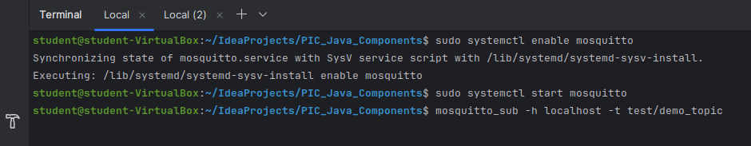
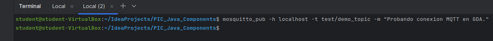
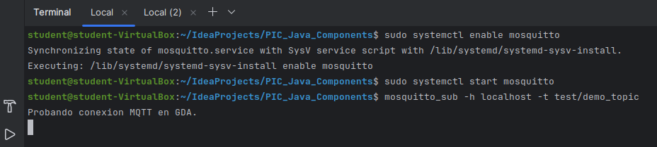

# Gateway Device Application (Connected Devices)

## Lab Module 07

Be sure to implement all the PIOT-GDA-* issues (requirements) listed.

### Description

NOTE: Include two full paragraphs describing your implementation approach by answering the questions listed below.

What does your implementation do? 

Se ha configurado e integrado un cliente MQTT en el sistema GDA, permitiendo la conexión, desconexión, 
publicación y suscripción a tópicos. Se define la lógica en el módulo MqttClientConnector siguiendo la interfaz 
IPubSubClient, incluyendo validaciones y logs informativos. También se preparan los métodos callback de 
MqttCallbackExtended, aunque su lógica se implementará en futuras prácticas. Finalmente, se integra el cliente en el 
DeviceDataManager y se crean tests específicos para validar la gestión de paquetes MQTT.

How does your implementation work?

A continuación, se detalla el procedimiento seguido para implementar los requisitos establecidos en el Lab Module 07:

PIOT-CFG-07-001 -> Se procede a dejar algunas capturas de pantalla para confirmar la correcta instalación de MQTT al 
utilizar el GDA:

PIOT-GDA-07-000 -> Se ha procedido a crear una nueva rama labmodule07 para empezar la elaboración de la práctica 07.

PIOT-GDA-07-001 -> Se ha editado el módulo "MqttClientConnector" para establecer toda la lógica para poder interactuar 
con el broker MQTT. Para ello, se han declarado un seguido de variables privadas para almacenar las referencias del 
cliente MQTT asó como las distintas propiedades asociadas. Seguidamente, en el constructor de la clase se obtienen los
valores de parámetros como el host, el puerto, uso de sincronismo o asincronismo, etc., desde el ConfigConst.

Por otro lado, se ha definido la lógica un seguido de métodos abstractos como "connectClient", "disconnectClient" 
(ambos declarados en la interfaz IPubSubClient) y "setDataMessageListener".

En esta sección, se ha ejecutado solamente el test de integración "MqttClientConnectorTest" y, en concreto, el test 
testConnectAndDisconnect() observando los diferentes logs o warnings establecidos cuando se conecta o se desconecta y 
cuando se reconecta o se redesconecta, respectivamente.

PIOT-GDA-07-002 -> Se ha editado nuevamente el módulo "MqttClientConnector" añadiendo por el momento logs informativos 
o warnings en los métodos callbacks abstractos definidos en la interfaz MqttCallbackExtended ("connectComplete", 
"connectionLost", "deliveryComplete", y "messageArrived"), ya que la implementación de estos se llevará en principio a 
cabo en la práctica 10.

En esta sección, se ha ejecutado solamente de nuevo el test de integración "MqttClientConnectorTest" y, en concreto, el 
test testConnectAndDisconnect() observando la misma salida que se pudo observar en el PIOT-GDA-07-001.

PIOT-GDA-07-003 -> Se ha editado nuevamente el módulo "MqttClientConnector" para implementar la lógica de los métodos 
abstractos restantes de la interfaz IPubSubClient como es el caso de "publishMessage", "subscribeToTopic" y 
"unsubscribeFromTopic". De esta forma, se proporciona la capacidad de publicar y suscribirse (o desuscribirse) al 
cliente MQTT, chequeando si la fuente es nula o si, por el contrario existe, y chequeando en publicar y suscribir si la 
calidad del servicio (QoS) posee valores característicos o en caso contrario se establece el valor por defecto definido 
en el programa. Por último, se ha editado también el método "isConnected" donde por el momento solo funcionaría la 
versión síncrona (es posible que más adelante se deba cambiar este método, ya que se deberá contemplar la opción de 
clientes asíncronos).

En esta sección, se ha ejecutado el test de integración "MqttClientConnectorTest" y, en concreto, el test 
testPublishAndSubscribe() observando los logs correspondientes a cuando se publica el mensaje y se suscribe o se 
desuscribe al tópico, así como los diferentes logs establecidos en el PIOT-GDA-07-002, indicando con que tópico llegó 
el mensaje, con que ID se entregó, entre otros.

PIOT-GDA-07-004 -> Se ha editado el módulo DeviceDataManager para poder aplicar las funcionalidades del cliente MQTT 
dentro de dicho módulo. Para ello, se ha aprovechado lo avanzado en el PIOT-GDA-05-004 mientras que se ha editado los 
métodos "initManager", "startManager" y "stopManager" para incorporar la conexión o desconexión del cliente MQTT en el 
momento de ejecutarse el DeviceDataManager que a su vez estará en el programa principal GDA.

Por otro lado, se ha implementado un nuevo módulo denominado "MqttClientControlPacketTest" con los tests 
"testConnectAndDisconnect", "testServerPing" y "testPubSub", que permitirán de manera simple generar lo necesario para 
el control de paquetes.

### Code Repository and Branch

NOTE: Be sure to include the branch.

URL: https://github.com/NicolGallo/PIC_Java_Components/tree/labmodule07

### Unit Tests Executed

NOTE: The instructor will execute your unit tests. You only need to list each test case below
(e.g. ConfigUtilTest, DataUtilTest, etc). Be sure to include all previous tests, too,
since you need to ensure you haven't introduced regressions.

- 
- 
- 

### Integration Tests Executed

NOTE: The instructor will execute most of your integration tests using their own environment, with
some exceptions (such as your cloud connectivity tests). In such cases, they'll review
your code to ensure it's correct. As for the tests you execute, you only need to list each
test case below (e.g. SensorSimAdapterManagerTest, DeviceDataManagerTest, etc.)

- MqttClientConnectorTest
- MqttClientControlPacketTest

EOF.
