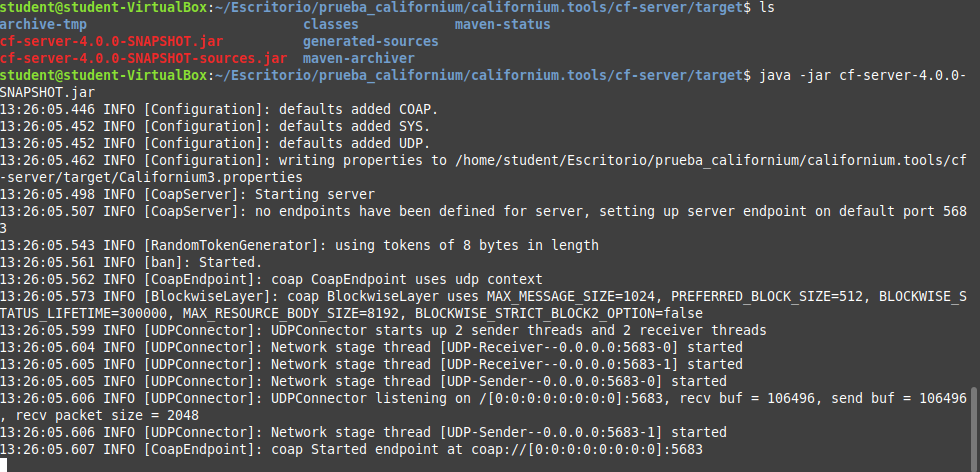
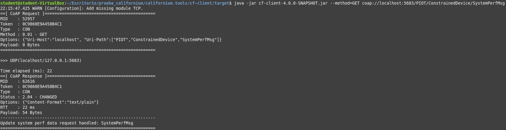

# Gateway Device Application (Connected Devices)

## Lab Module 08

Be sure to implement all the PIOT-GDA-* issues (requirements) listed.

### Description

NOTE: Include two full paragraphs describing your implementation approach by answering the questions listed below.

What does your implementation do? 

How does your implementation work?

A continuación, se detalla el procedimiento seguido para implementar los requisitos establecidos en el Lab Module 08:

PIOT-CFG-08-001 -> Se ha procedido a instalar y configurar las herramientas del Californium CoAP para testear el 
servidor CoAP creado. Para el testeo se han realizado un par de pruebas.

1) Arrancar el server 

2) Pasar un test de modo cliente

PIOT-GDA-08-000 -> Se ha procedido a crear una nueva rama labmodule8 para empezar la elaboración de la práctica 08.

PIOT-GDA-08-001 -> Primeramente, se ha modificado el pom.xml del proyecto para actualizar las dependencias incluyendo la
dependencia del Californium. Seguidamente, se ha procedido a editar el módulo "CoapServerGateway" añadiendo la lógica de
los métodos "startServer" y "stopServer" para poder arrancar o parar el servidor CoAP. Por otro lado, se ha añadido la 
lógica del initServer para inicializar el servidor en caso de no estarlo. Por último, las modificaciones realizadas en 
el anterior módulo se han incluido en el DeviceDataManager, en que se ha añadido una lógica similar a cuando se efectuó 
el MQTT en los métodos "startManager" y "stopManager", así como la línea de código del método privado "initManager" 
indicando que si está habilitado el servidor CoAP se cree una instancia del CoapServerGateway.

En esta sección, no se han efectuado tests, ya que tal y como especifica las notas del Notion proporcionado, el CoAP 
Server necesita tener almenos un endpoint definido antes de que tenga ninguna utilidad real y la ejecución de este hecho
se realizará más adelante.

PIOT-GDA-08-002 -> Dentro del directorio "handlers", se ha procedido a crear dos nuevas clases: 
UpdateSystemPerformanceResourceHandler y UpdateTelemetryResourceHandler, los cuales permitirán que el CDA envie 
peticiones PUT para SensorData y SystemPerformanceData al GDA. Dentro de las clases creadas, se ha añadido una 
estructura similar a la plantilla proporcionada por el módulo "GenericCoapResourceHandler", que cuenta con un 
constructor y un conjunto de métodos públicos: setDataMessageListener, handlePUT, handleGET, handleDELETE y handlePOST, 
los cuales se han sobreescrito.

En esta sección, se ha modificado el módulo de tests denominado "CoapClientToServerConnectorTest" añadiendo un pequeño 
test de prueba para chequear la implementación del método PUT. 

PIOT-GDA-08-003 -> Se ha procedido a crear una nueva clase dentro del directorio "handlers" denominada 
GetActuatorCommandResourceHandler, la cual permitirá que el GDA de forma eventual pueda notificar al CDA de comandos de 
actuación a través de la especificación CoAP OBSERVE. Para la implementación, se ha realizado de una forma similar a la 
estructura que presentan las clases creadas en el PIOT-GDA-08-002, con la diferencia que se ha implementado un nuevo 
método denominado "onActuatorDataUpdate" que simplemente devuelve true o false en función de si se ha producido un 
cambio o actualización en el actuador y sólo se ha implementado el método "handleGET", ya que es el único necesario para
el handler de este recurso.

En esta sección, no se ha ejecutado ningún test.

PIOT-GDA-08-004 -> Se ha procedido a actualizar los módulos "CoapServerGateway" (para incorporar el soporte de la 
adición de instancias de recursos creados de forma interna o bien recursos creados de forma externa que se proceden a 
pasar al servidor) y "DeviceDataManager" (para dar soporte al registro de almenos una referencia de un 
IActuatorDataListener).

Para el primer propósito, se ha modificado el método "addResource", el cual a su vez llama a otro método denominado 
"createAndAddResourceChain" que permite crear cada recurso con la estructura apropiada que se requiere. Por último, se 
ha modificado el método "initServer" para crear la instancia del servidor CoAP si no está creado, en que si no hay 
recursos disponibles utiliza unos recursos por defecto del tipo GetActuatorCommandResourceHandler, 
UpdateTelemetryResourceHandler y UpdateSystemPerformanceResourceHandler.

Para el segundo propósito, se ha modificado ligeramente el método "setActuatorDataListener" del DeviceDataManager para 
crear un escuchador del tipo IActuatorDataListener. Por otro lado, se ha añadido una lógica parcial (ya que se 
completará o será necesaria en laboratorios posteriores) del método privado "handleIncomingDataAnalysis", el cual 
debería ser llamado siempre que haya un ActuatorData en camino.

En esta sección, se ha procedido a ejecutar el test de integración "CoapServerGatewayTest" y también se ha procedido a 
utilizar el Californium Tools CLI client para testear las implementaciones GET y POST llevadas a cabo sobre el 
siguiente recurso: PIOT/ConstrainedDevice/SystemPerfMsg. En la foto de a 
continuación, se puede observar la salida por terminal con el Californium Tools CLI client, que resulta bastante similar
a la esperada dadas las notas del Notion proporcionado:

En la imagen se puede observar puntos clave a comentar:

1. CoAP Request: Se envió una solicitud CoAP de tipo GET al recurso coap://localhost:5683/PIOT/ConstrainedDevice/SystemPerfMsg.

2. UDP[localhost/127.0.0.1:5683]: El cliente ha enviado la solicitud a través de UDP a la dirección y puerto especificados.

3. CoAP Response: El servidor CoAP respondió.

4. Status: 2.04 - CHANGED: El servidor ha respondido con un código de estado 2.04 CHANGED. Este hecho puede ser un poco
inusual para un GET (normalmente se esperaría 2.05 CONTENT para una respuesta exitosa con datos). Sin embargo, podría 
indicar que el servidor procesó la solicitud GET de alguna manera que resultó en un "cambio" en su estado interno o en 
el recurso.

5. Options: {"Content-Format":"text/plain"}: Se indica que la respuesta contiene texto plano.

6. Payload: 54 Bytes: El cuerpo de la respuesta tiene 54 bytes.

7. update system perf data request handled: SystemPerfMsg: Este es el contenido del payload de la respuesta del servidor.
Indica que tu servidor CoAP ha procesado la solicitud GET para el recurso SystemPerfMsg.

### Code Repository and Branch

NOTE: Be sure to include the branch.

URL: https://github.com/NicolGallo/PIC_Java_Components/tree/labmodule8 

### Unit Tests Executed

NOTE: The instructor will execute your unit tests. You only need to list each test case below
(e.g. ConfigUtilTest, DataUtilTest, etc). Be sure to include all previous tests, too,
since you need to ensure you haven't introduced regressions.

- 
- 
- 

### Integration Tests Executed

NOTE: The instructor will execute most of your integration tests using their own environment, with
some exceptions (such as your cloud connectivity tests). In such cases, they'll review
your code to ensure it's correct. As for the tests you execute, you only need to list each
test case below (e.g. SensorSimAdapterManagerTest, DeviceDataManagerTest, etc.)

- CoapServerGatewayTest
- CoapClientToServerConnectorTest
- 

EOF.
