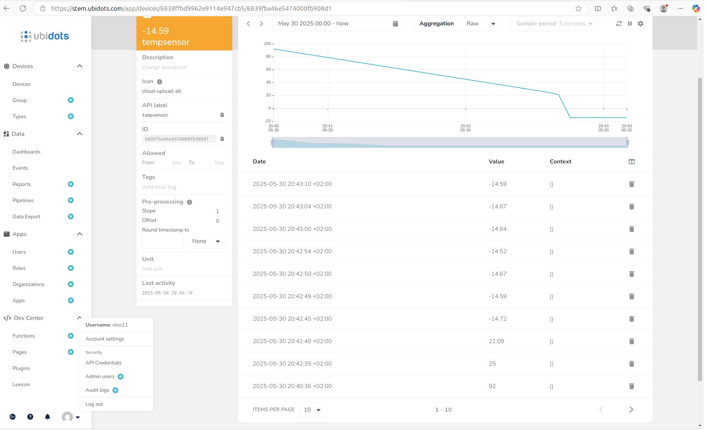

# Gateway Device Application (Connected Devices)

## Lab Module 11

Be sure to implement all the PIOT-GDA-* issues (requirements) listed.

### Description

NOTE: Include two full paragraphs describing your implementation approach by answering the questions listed below.

What does your implementation do? 

Se conecta la aplicación con la plataforma cloud establecida Ubidots mediante MQTT, permitiendo así enviar datos de 
sensores y rendimiento del sistema al cloud, así como recibir y procesar comandos de actuación remotos. Para ello, se 
han adaptado los módulos de comunicación y gestión de datos, integrando el soporte necesario para la publicación y 
suscripción a eventos cloud.

How does your implementation work?

PIOT-CFG-11-001 -> Se ha procedido a crear una cuenta en el proveedor del servicio cloud IoT denominado Ubidots STEM. A
continuación, se han seguido los pasos establecidos por la guía para obtener el certificado para el uso del servicio y se 
ha ejecutado el script de python que figura en la propia guía de Ubidots STEM para probar la correcta conexión mediante, 
el certificado, al broker MQTT de Ubidots.

Por último, se ha modificado el archivo Config.props añadiendo en los datos del cliente cloud el baseTopic y el host
(ahora siendo este último industrial.api.ubidots.com).

PIOT-GDA-11-100 -> Se ha procedido a crear una nueva rama labmodule11 para empezar la elaboración de la práctica 11.

PIOT-GDA-11-101 -> Se ha procedido a modificar el módulo "MqttClientConnector" para adicionar algunas funcionalidades 
respecto a etapas anteriores. Para ello, primeramente se han añadido dos constructores más a la clase para poder soportar 
o admitir la configuración MQTT desde la sección del servicio cloud con las modificaciones efectuadas en el CFG-11-001 
previamente. A continuación, se han añadido un seguido de métodos protegidos para publicar, suscribirse y desuscribirse, 
con la finalidad de migrar la lógica implementada en los métodos "publishMessage", "subscribeToTopic" y "unsubscribeFromTopic"
a estos nuevos métodos protegidos.

En esta sección, se ha ejecutado el test de integración "MqttClientConnectorTest".

PIOT-GDA-11-102 -> No se ha procedido a hacer ninguna modificación ni implementación dado que el módulo comentado en la 
sección ya está definido en el proyecto.

PIOT-GDA-11-103 -> Se ha procedido a implementar toda la lógica de los métodos del módulo CloudClientConnector la cual 
es una implementación de la interfaz ICloudClient, incluyendo los siguientes: "connectClient", "disconnectClient", 
"sendEdgeDataToCloud" (tanto para enviar desde el edge datos relacionados con sensores o SensorData, o bien datos 
relacionados con datos de rendimiento del sistema o SystemPerformanceData), "subscribeToCloudEvents" y 
"unsubscribeFromCloudEvents". Por otro lado, también se han implementado una serie de métodos privados como 
"createTopicName" y "publishMessageToCloud", teniendo en completo las funciones básicas para poder conectar con el servicio 
cloud establecido.

Seguidamente, en el módulo DeviceDataManager se han llevado a cabo diferentes actualizaciones sobretodo en los métodos 
"handleActuatorCommandRequest" (para poder gestionar correctamente los comandos de entrada de los ActuatorData), 
"handleSensorMessage" y "handleSystemPerformanceMessage" para poder llamar en cada método a la función privada
"handleUpstreamTransmission" que permite mandar al cloud los datos dependiendo de si corresponder a datos de sensores
(SensorData) o corresponden a datos del rendimiento del sistema (SystemPerformanceMessage). 

En esta sección, se ha ejecutado el test de integración "CloudClientConnectorTest".

PIOT-GDA-11-104 -> Se ha procedido a implementar nuevas funcionalidades en el módulo "CloudClientConnector" como el handler 
para procesar eventos de actuación LED de llegada (se ha declarado el handler como una clase privada dentro del módulo) y 
un seguido de métodos privados recomendados para crear nombres de tópicos del proveedor del servicio cloud empleado.
También, se ha actualizado el módulo "DeviceDataManager", en concreto el método "handleIncomingMessage" para poder procesar 
datos de entrada como instancias del tipo de dato ActuatorData en un formato JSON de llegada.

En esta sección, se ha ejecutado el test de integración de la parte 4 hecha para la conexión cloud denominado 
"CloudClientConnectorTest".

A continuación, se procede a enseñar una captura de pantalla pudiendo observar la variable los diferentes valores recogidos
durante la ejecución de la aplicación CDA y GDA con respecto al sensor de temperatura, indicando una buena conexión entre 
los valores simulados por los sensores, el broker MQTT y el servicio cloud:

Nota: No se encontró la forma de crear el trigger en el cloud.

### Code Repository and Branch

NOTE: Be sure to include the branch.

URL: https://github.com/NicolGallo/PIC_Java_Components/tree/labmodule11

### Unit Tests Executed

NOTE: The instructor will execute your unit tests. You only need to list each test case below
(e.g. ConfigUtilTest, DataUtilTest, etc). Be sure to include all previous tests, too,
since you need to ensure you haven't introduced regressions.

- No se han ejecutado test unitarios en esta práctica.

### Integration Tests Executed

NOTE: The instructor will execute most of your integration tests using their own environment, with
some exceptions (such as your cloud connectivity tests). In such cases, they'll review
your code to ensure it's correct. As for the tests you execute, you only need to list each
test case below (e.g. SensorSimAdapterManagerTest, DeviceDataManagerTest, etc.)

- MqttClientConnectorTest
- CloudClientConnectorTest

EOF.
