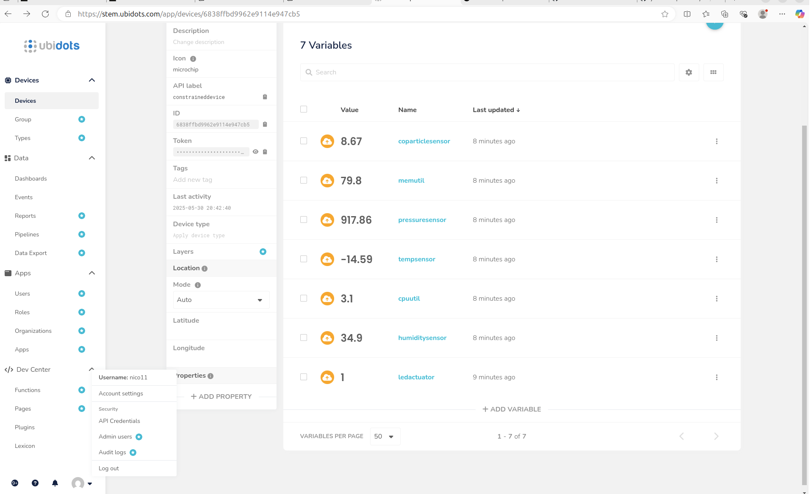
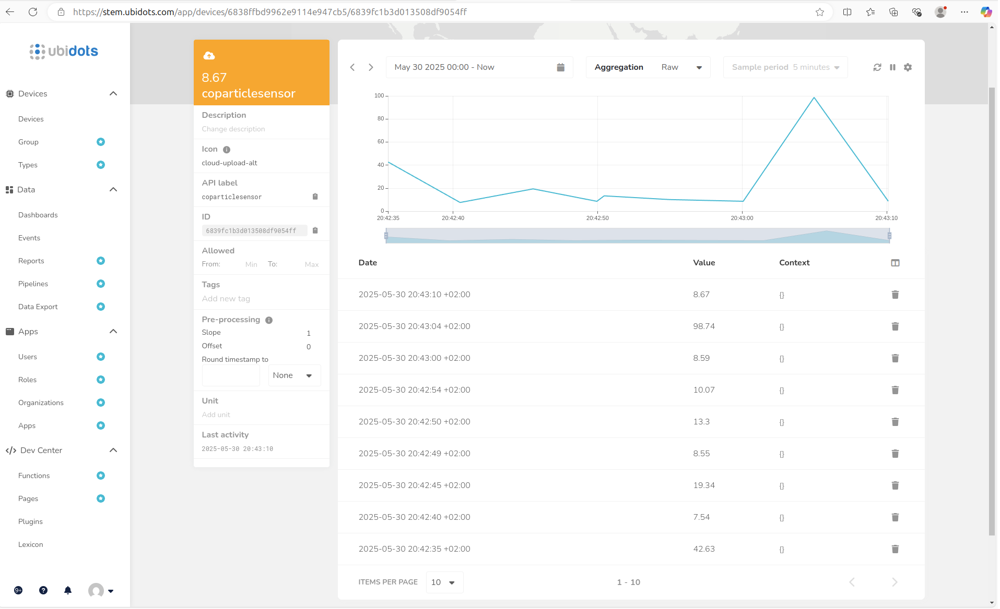

# Constrained Device Application (Connected Devices)

## Lab Module 12 - Semester Project - CDA Components

Be sure to implement all the PIOT-CDA-* issues (requirements) listed.

### Description

NOTE: Include two full paragraphs describing your implementation approach by answering the questions listed below.

What does your implementation do? 

En esta última práctica se ha llevado a cabo la implementación requerida de un nuevo sensor y nuevo actuador. En este caso, 
la implementación es acerca de un sensor de partículas CO (monóxido de carbono) para estimar o efectuar la medición de la 
concentración de estas partículas en el aire (debido a su potencial peligro contra la salud), y de un actuador que 
efectuaría la función de un buzzer o bocina de alarma.

How does your implementation work?

Para el desarrollo de la implementación, se han tenido que crear nuevos módulos así como los tests asociados a la 
implementación de cada nuevo módulo. Primeramente, se han añadido los valores mínimos y máximos simulados que puede 
presentar el sensor en el archivo PiotConfig.props (10 y 50 ppm, respectivamente). Seguidamente, se han añadido determinados 
valores clave como nombre del sensor, tipo del sensor, nombre del actuador, etc., siguiendo el patrón diseñado para 
otros sensores o actuadores ya implementados en el código original.

Los módulos "SensorAdapterManager", "ActuatorAdapterManager" y "SensorDataGenerator" han sido modificados en su implementación para incorporar 
la lógica necesaria para la correcta o funcional implementación, así como la creación de nuevos módulos como 
"CoParticleEmulatorTask" y "CoParticleSensorEmulatorTask" (para poder efectuar la emulación del sensor y actuador) y también 
"CoParticleActuatorSimTask" y "CoParticleSensorSimTask" (para efectuar la simulación del sensor y actuador).

Finalmente, se ha procedido a la creación de un seguido de tests simples para la comprobación del buen comportamiento de 
los módulos y la lógica implementada. Entre los nuevos tests creados están los tests de integración "CoParticleActuatorEmulatorTaskTest" y
"CoParticleEmulatorTaskTest", y los tests unitarios "CoParticleActuatorSimTaskTest" y "CoParticleSensorSimTaskTest". 

Nota: Se ha intentado establecer en cada sección implementada una forma clara de visualizar en el código actualizado y llevado 
a cabo para incorporar el sensor y el actuador.

Nota: Se adjunta una captura de pantalla del cloud donde se puede observar la publicación de los datos al device durante 
la ejecución de la aplicación CDA y GDA.

NOTA DE CARA AL GDA: No se ha podido implementar por falta de tiempo la función necesaria para gestionar (como los handlers elaborados 
en las últimas prácticas) los datos de llegada del sensor para chequearlos y proceder a la activación del actuador o no
(en este caso sería el buzzer o alarma). Por lo que esa implementación quedaría pendiente de llevarse a cabo

### Code Repository and Branch

NOTE: Be sure to include the branch.

URL: https://github.com/NicolGallo/PIC_Python_Components/tree/labmodule12

### Unit Tests Executed

NOTE: The instructor will execute your unit tests. You only need to list each test case below
(e.g. ConfigUtilTest, DataUtilTest, etc). Be sure to include all previous tests, too,
since you need to ensure you haven't introduced regressions.

- Todos los tests unitarios correspondientes a la parte1, parte2 y parte3.
- CoParticleActuatorSimTaskTest
- CoParticleSensorSimTaskTest

### Integration Tests Executed

NOTE: The instructor will execute most of your integration tests using their own environment, with
some exceptions (such as your cloud connectivity tests). In such cases, they'll review
your code to ensure it's correct. As for the tests you execute, you only need to list each
test case below (e.g. SensorSimAdapterManagerTest, DeviceDataManagerTest, etc.)

- Todos los tests correspondientes a la parte1, parte2 y parte3.
- CoParticleEmulatorTaskTest
- CoParticleActuatorEmulatorTaskTest

EOF.
